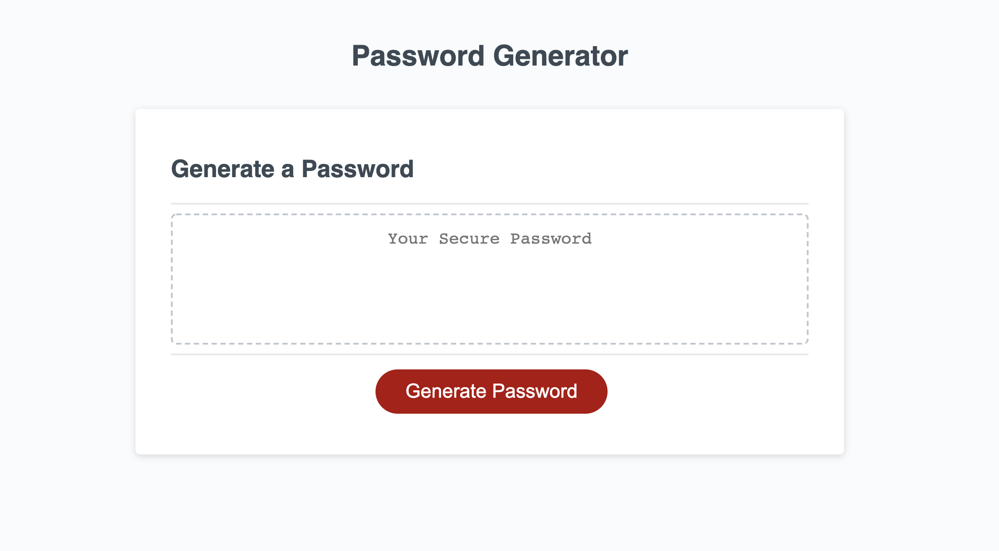

# HW3-Password-Generator

## Description

Generates a password according to the specified user requirements. Allows the user to select:

 - Password length from 8 - 128 characters
 - Inclusion of lowercase letters
 - Inclusion of uppercase letters
 - Inclusion of numbers
 - Inclusion of special characters (e.g. $, ?, *)

This password generator ensures all the user selected criteria is included in the password. This is done by generating a number which is evenly distributed amoung the number of selected criterias, and pull that number of characters to form a password. 
 
For example, if:
    Password length = 12,
    Include lowercase,
    Include uppercase,
    Include numbers,
    Include special characters,
it will randomly pull out 12/4 = 3 characters from each of the criteria and put it into an array which will then randomly arrange the array to generate a password.

If there is a remainder when dividing the password length and the number of criteria, it will add the remainder value to a random criteria to pull out an extra number of characters.

A super challenging task which tested the limits of brain power and filled search histories with Google.

## Usage

## Get Your Password!

https://acho9138.github.io/HW3-Password-Generator/

## Credits

Thank you to the following resources to make this website possible:

- The Coding Bootcamp at University of Sydney
- MDN
- Stack Overflow
- w3schools.com
- Web Dev Simplified Youtube Video https://www.youtube.com/watch?v=iKo9pDKKHnc
- Javascript.info https://javascript.info/task/shuffle
